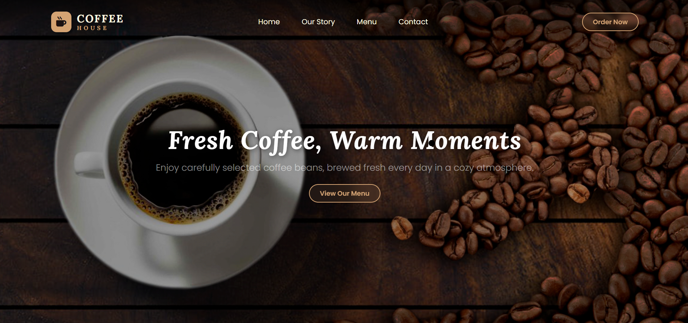
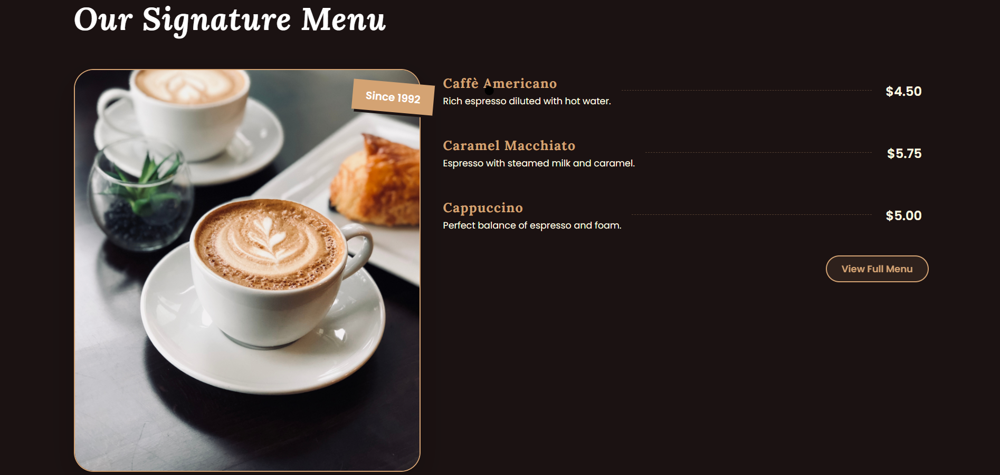

# ☕ Coffee House Website

A simple and responsive **coffee shop website** built with **HTML**, **CSS**, and **Bootstrap 5**.  
Perfect for showcasing your coffee menu, story, and contact information.

---

## 🌟 Features

- Fully **responsive design** (desktop, tablet, mobile)  
- **Hero section** with call-to-action button  
- **About section** with images and company story  
- **Menu section** with signature coffee items  
- **Contact section** with Google Map and contact info  
- **Footer** with social media links and quick navigation  

---

## 🛠 Technologies Used

- **HTML5**
- **CSS3**
- **Bootstrap 5**
- **Font Awesome** (icons)
- **Google Fonts**: *Lora* & *Poppins*

---

## Preview

  
  


---

## 🚀 Getting Started

1. **Clone the repository**:
   ```bash
   git clone https://github.com/eliftelli/coffee-shop-site.git
    ``` 

2. Open index.html in your browser.
   No server setup required — fully static website.

## 🔗 Live Preview

> **🌐 Live Demo:** [View Coffee House in Action!](https://eliftelli.github.io/coffe-shop-site/)